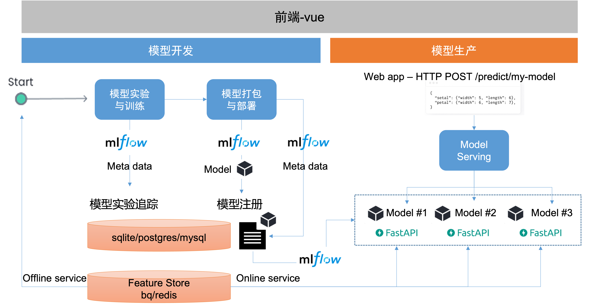

<h1 align="center"><a href="https://github.com/leepand/open-mlops">mlopskit</a></h1>
<p align="center">
  <em>MLOps for (online) machine/reinforcement learning</em>
</p>

---

<p align="center">
  <a href="https://github.com/leepand/mini-mlops"></a>
  <a href="https://github.com/leepand/mini-mlops"></a>
   <a href="https://github.com/leepand/mini-mlops"></a> 
  <a href="https://github.com/leepand/mini-mlops"></a>    
   <a href="https://github.com/leepand/mini-mlops"></a>   
   <a href="https://github.com/leepand/mini-mlops"></a>   
   
</p>

`mlopskit` 是一个简约而功能齐全的从0-1的 MLOps 项目，专为想要将ML模型部署到生产环境的数据科学家或算法工程师而构建的，旨在使数据科学家们开发的 ML 模型可重用、健壮、高性能且易于部署，适应于中小型企业的 MLOps 实践参考。

我们希望提供一款极简风的MLOps，它可以处理无聊的事情，可以嵌入现有系统，并且使用起来很有趣。

## 特性

将您的预测代码包装在`mlopskit`中可以立即继承以下功能：
- **Online-first：** 专为在线机器学习/强化学习模型而设计，同时也支持批处理。
- **可组合：** 模型可以依赖于其他模型，并根据需要评估它们
- **类型安全：** 模型的输入和输出可以通过[pydantic](https://pydantic-docs.helpmanual.io/)进行验证，你可以为你的预测获得类型注释，并且可以在开发过程中用静态类型分析工具捕捉错误。
- **异步：** 模型支持异步和同步的预测功能。`mlopskit`支持从同步代码中调用异步代码，这样你就不必受部分异步代码的影响。
- **可测试：** 模型携带自己的单元测试案例，单元测试使用[pytest](https://docs.pytest.org/en/6.2.x/)框架。
- **快速部署：** 模型可以通过使用[fastapi](https://fastapi.tiangolo.com/)在单个CLI调用中提供。
- **协作化：** 可以将你的ML库和工件以Python包或服务的形式与他人分享。让其他人使用和评估你的模型
- **快速编码：** 只需编写业务和模型逻辑，就可以了。没有繁琐的前处理或后处理逻辑、分支选项等。
- **支持批量测测：** 可以以最小的开销对模型预测进行批处理（可以自定义批处理逻辑）

## 🤱 快速开始

### 启动服务:

```bash
mlopskit run -s all --backend true
```

服务运行成功日志:

```bash
2023-09-07 16:58:06 [info     ] mlopskit config file mlops_config.yml! path=/Users/leepand/.mlopskit/mlops_config.yml
2023-09-07 16:58:06 [debug    ] your script sh run.sh is processed success
2023-09-07 16:58:06 [info     ] stdout info: your script is processed success! name=mlflow service serving
2023-09-07 16:58:06 [debug    ] your script nohup sh run_model_server.sh > run_model_server.log 2>&1 & is processed success
2023-09-07 16:58:06 [info     ] stdout info: your script is processed success! name=model server service serving
2023-09-07 16:58:06 [debug    ] your script nohup gunicorn --workers=3 -b 0.0.0.0:8080  mlopskit.server.wsgi:app >main_server.log 2>&1 & is processed success
2023-09-07 16:58:06 [info     ] serving ui info: your script is processed success! name=main service serving
```

### 创建新项目（模型）:

项目名称-mlops_new_proj，模型名称-new_model，模型版本-2:

```bash
mlopskit init -p mlops_new_proj -m new_model -v 2
# 创建成功日志：
# 2023-09-07 16:43:28 [info     ] Project mlops_new_proj is created! name=mlops_new_proj
```

### 模型注册：

```
mlopskit regmodel --name new_model --filesdir mlops_new_proj
```

模型注册成功日志示例：

```bash
Confirm register model new_model files to remote repository (y/n)y
2023-09-07 17:23:26 [info     ] APIs of mlopskit               model_name=new_model model_version=None ops_type=model
2023-09-07 17:23:26 [info     ] The list of all versions for the current model is [1, 2, 3, 4].
2023-09-07 17:23:26 [warning  ] Using the latest versioned model `4` instead of the unversioned model `None`.If you insist on doing so, we will create a new version `5` for you.
2023-09-07 17:23:26 [info     ] Usage of mlopskit-model        Params={'ops_type': 'push/pull/serving/predict/killservice/serving_status, default:push'}
2023-09-07 17:23:26 [info     ] Usage of mlopskit-push         Params={'to_push_file': 'model file/dir to upload to remote model space', 'push_type': 'file/pickle, default: file'}
2023-09-07 17:23:26 [info     ] Usage of mlopskit-pull         Params={'save_path': 'local path to download model'}
2023-09-07 17:23:27 [info     ] model version 5 is created!
```

### 模型开发

`mlopskit`使用mlflow进行模型实验的跟踪、模型注册等功能，并提供了一种直接且一致的方式来将预测代码封装在一个Model类中：

```python
from mlopskit.ext.store.yaml.yaml_data import YAMLDataSet
from mlopskit import Model, ModelLibrary, make
from mlopskit.log_base import create_log_path

import traceback
import numpy as np
import os
import json

from utils import debug_log

class RecomServer(Model):
    CONFIGURATIONS = {"recomserver": {}}

    def _load(self):
        # 创建日志路径
        self.reocm_logs_path = create_log_path("{{model_name}}", "recom_errors")
        self.recom_logs_debug = create_log_path("{{model_name}}", "recom_debugs")
        self.debug_db = make("cache/feature_store-v1", db_name="debug_tests.db")

        self.model_db = make(
            "cache/{{model_name}}-v{{version}}", db_name="{{model_name}}.db"
        )

    def _predict(self, items):
        uid = items.get("uid")
        request_id = items.get("request_id")
        try:
            debug_log(
                items=items,
                model_name="{{model_name}}",
                debug_db=self.debug_db,
                logs_debug=self.recom_logs_debug,
                request_id=request_id,
            )

            return items
        except:
            # 将异常堆栈信息写入错误日志文件
            log_file = os.path.join(self.recom_logs_path, f"{request_id}_error.txt")
            with open(log_file, "w") as f:
                f.write(str(traceback.format_exc()))

            return items


library = ModelLibrary(models=[RecomServer])

model = library.get("recomserver")
```

### 模型部署

- `--pipe`: 模型名称
- `--filename`: 模型版本所在目录
- `--toremote`: 代码文件上传至模型空间
- `--profile`: 指定环境，`dev`为开发环境，`preprod`为预上线环境，`prod`为生产环境

```bash
mlopskit push --pipe new_model --filename mlops_new_proj --toremote --preview --profile prod

2023-09-07 18:13:54 [info     ] Usage of mlopskit-client       Params={'host': 'set/get, default:get', 'config': 'config file, default:None'} Return=HTTPClient
2023-09-07 18:13:54 [info     ] APIs of mlopskit               model_name=model model_version=None ops_type=config
2023-09-07 18:13:54 [info     ] Usage of mlopskit-config       Params={'config_ops': 'set/get, default:get', 'get': {'config_path': 'default:None', 'set': {'config_content': 'config cintent,Dict', 'config_path': 'default:None'}}}
Successfully connected to pipe new_model. 
pushing: 0.04MB
2023-09-07 18:13:54 [info     ] APIs of mlopskit               model_name=new_model model_version=5 ops_type=model
2023-09-07 18:13:54 [info     ] The list of all versions for the current model is [1, 2, 3, 4, 5].
2023-09-07 18:13:54 [info     ] Usage of mlopskit-model        Params={'ops_type': 'push/pull/serving/predict/killservice/serving_status, default:push'}
2023-09-07 18:13:54 [info     ] Usage of mlopskit-push         Params={'to_push_file': 'model file/dir to upload to remote model space', 'push_type': 'file/pickle, default: file'}
2023-09-07 18:13:54 [info     ] Usage of mlopskit-pull         Params={'save_path': 'local path to download model'}
2023-09-07 18:13:54 [info     ] model version 5 is updated!
100%|██████████████████████████████████████████████████████████████████████████████████████████| 13/13 [00:00<00:00, 4458.01it/s]
2023-09-07 18:13:54 [info     ] Push codes:['logs/README.md', 'notebooks/open_debug_db.py', 'src/utils.py', 'notebooks/serving.py', 'README.md', 'notebooks/.ipynb_checkpoints/servinfgipynb-checkpoint', 'notebooks/.ipynb_checkpoints/serving-checkpoint.py', 'src/rewardserver.py', 'notebooks/config.py', 'config/server_prod.yml', 'config/server_dev.yml', 'notebooks/servinfgipynb', 'src/recomserver.py']
```

### 模型服务化

```python
from mlopskit.pipe import ServiceMgr
from mlopskit import Client

test = ServiceMgr(["new_model"], env="dev")
test.start_service()
test.scan_logs(100000)
```

服务化开启日志：

```bash
2023-09-07 17:40:08 [info     ] Usage of mlopskit-client       Params={'host': 'set/get, default:get', 'config': 'config file, default:None'} Return=HTTPClient
2023-09-07 17:40:08 [info     ] APIs of mlopskit               model_name=model model_version=None ops_type=config
2023-09-07 17:40:08 [info     ] Usage of mlopskit-config       Params={'config_ops': 'set/get, default:get', 'get': {'config_path': 'default:None', 'set': {'config_content': 'config cintent,Dict', 'config_path': 'default:None'}}}
Successfully connected to pipe new_model. 
2023-09-07 17:40:08 [debug    ] Generating Model Serverfile via templates from ServerFile.j2 ...
2023-09-07 17:40:08 [debug    ] Generating run cmd script ...
2023-09-07 17:40:08 [debug    ] your script cd /Users/leepand/mlopskit/files/dev/new_model/v2/src && sh /Users/leepand/mlopskit/files/dev/new_model/v2/src/run_recomserver_4001.sh is processed success
2023-09-07 17:40:09 [info     ] model: new_model, server:recomserver port: 4001 is running
2023-09-07 17:40:09 [debug    ] Generating Model Serverfile via templates from ServerFile.j2 ...
2023-09-07 17:40:09 [debug    ] Generating run cmd script ...
2023-09-07 17:40:09 [debug    ] your script cd /Users/leepand/mlopskit/files/dev/new_model/v2/src && sh /Users/leepand/mlopskit/files/dev/new_model/v2/src/run_rewardserver_5001.sh is processed success
2023-09-07 17:40:11 [info     ] model: new_model, server:rewardserver port: 5001 is running
```

## 技术架构



## Documentation
使用范例可在[docs](docs)文件夹中找到。

- [客户端使用](docs/mlops-client.md)
    - [客户端配置](docs/mlops-client.md#settings)
- [模型实验跟踪](docs/mlops-tracking.md)
    - [Experiment](docs/mlops-tracking.md#experiment)
    - [Run](docs/mlops-tracking.md#run)
    - [Run Metrics](docs/mlops-tracking.md#run-metrics)
    - [Model](docs/mlops-tracking.md#model)
    - [Model version](docs/mlops-tracking.md#model-version)
- [模型部署](docs/mlops-deploy.md)
    - [Push Model](docs/mlops-deploy.md#push-model)
    - [Pull Model](docs/mlops-deploy.md#pull-model)
- [模型服务化](docs/mlops-serving.md)
    - [Serving Model](docs/mlops-serving.md#serving-model)
    - [Serving Model Status](docs/mlops-serving.md#serving-model-status)
- [数据存储](docs/mlops-data-store.md)
    - [日志存储](docs/mlops-data-store.md#events-record)
    - [模型存储](docs/mlops-data-store.md#model-store)
    - [特征存储](docs/mlops-data-store.md#feature-store)

## 🌳 updated 2.0.1

step1:

mlopskit init -p $v$x

如果是新版本，需要 eg. mlopskit regmodel --name some_model --filesdir $v$x

编辑config/server_xx.yml配置：

ops_servers: type：list，需要服务的代码文件名
文件名作为key：

step2:
将模型上传至共享repo，默认为dev环境（对应config/server_dev.yml），mlopskit push --pipe some_model --filename v1 --preview
如果上传至生产repo（需要编写config/server_prod.yml，注意端口是否占用），mlopskit push --pipe some_model --filename v1 --profile prod --preview

step3:
服务化：
```python
from mlopskit.pipe import ServiceMgr
test=ServiceMgr(["some_model"],env="dev") # 如果生产环境，则env="prod"
test.start_service()
test.scan_logs()
```

## 相关资源
* [MLOps-机器学习从开发到生产](https://github.com/leepand/MLOps-practice)<br/>
